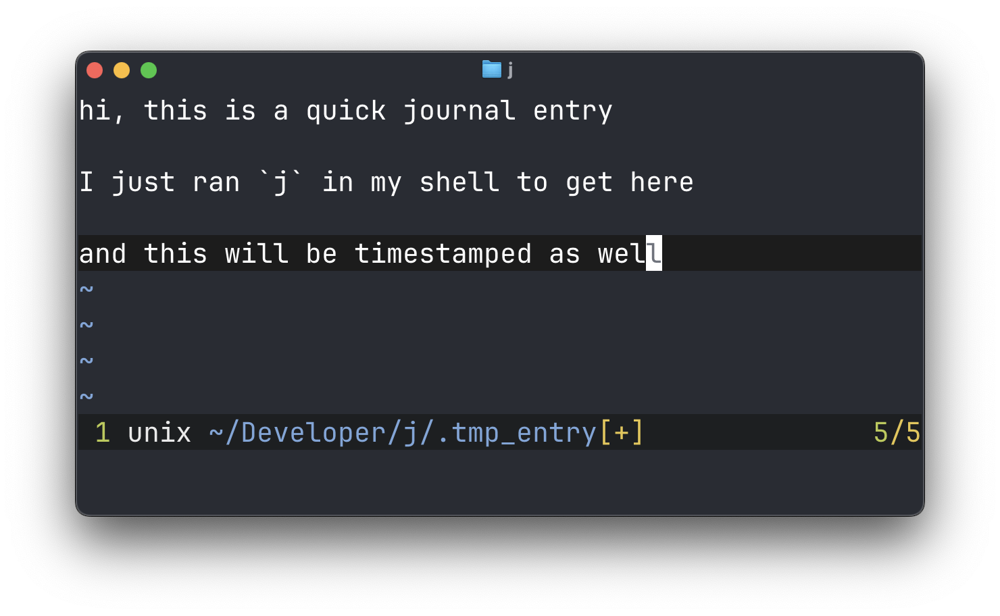
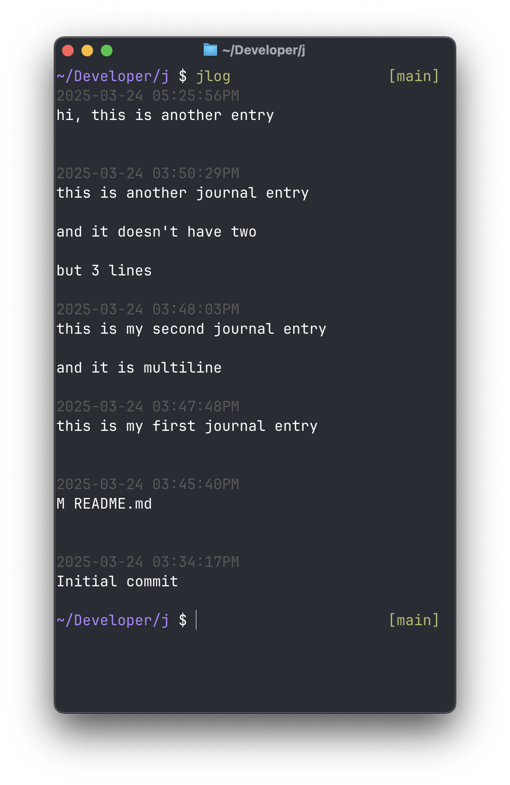

# git-diary

Git as a diary engine. Paragraph-based.
Inspired by [Notetime App](https://notetimeapp.com)




## Quick Start

1. Fork this repo
2. Clone your fork
3. Set `JOURNAL_DIR` to the path of the newly cloned fork
4. Add the `j` and `jlog` functions to your `.zshrc` or `.bashrc` so you can run them from anywhere in your shell

## Writing new journal entries

```bash
function j() {
    if [ -z "$JOURNAL_DIR" ]; then
        echo "Error: JOURNAL_DIR environment variable is not set"
        return 1
    fi

    cd $JOURNAL_DIR
    TMPFILE=".tmp_entry"

    vim -c "startinsert" "$TMPFILE"

    # # goyo user?
    # vim -c "Goyo" -c "startinsert" "$TMPFILE"

    if [ -s "$TMPFILE" ]; then
        git add "$TMPFILE"
        git commit -m "$(cat "$TMPFILE")" --date="$(date -R)"
    fi

    rm "$TMPFILE"
}
```

Launching `j` will launch vim with an empty temp file, which can be used for writing
the new journal entry. After `:wq`-ing vim, a new commit in the `JOURNAL_DIR` will
be created with the content of the file as commit message.

This technique allows to use git as an effective journaling engine.

## Reading the journal

```bash
function jlog() {
    if [ -z "$JOURNAL_DIR" ]; then
        echo "Error: JOURNAL_DIR environment variable is not set"
        return 1
    fi

    cd $JOURNAL_DIR
    git log --pretty=format:"%C(240)%ad%Creset%n%s%n%n%b" --date=format:"%Y-%m-%d %I:%M:%S%p"
}
```

Launching `jlog` from anywhere in the terminal will pretty print the messages of the `JOURNAL_DIR`
git commits, which will be the conten of the journal itself.
